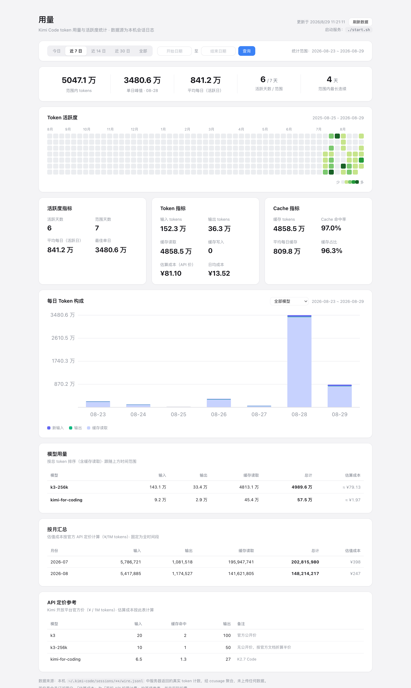

# kimi-usage-dashboard

**English** | [简体中文](README.zh-CN.md)

A local dashboard for Kimi Code token usage — reads your local session logs, aggregates them, and visualizes your token consumption and activity.

All data is processed locally. Nothing is uploaded anywhere.



## Features

- **Top stat strip**: tokens in range, peak day, daily average, active days, longest streak
- **Activity heatmap**: GitHub-style, trailing one year
- **Metric cards**: activity / token / cache hit rate and more
- **Daily token breakdown**: stacked bar chart (fresh input / output / cache read / cache write), filterable by model
- **Per-model usage table**: sorted by total tokens, with cost estimated at official API prices
- **Monthly summary** and **API pricing reference**
- **Time range filter**: today / last 7 / 14 / 30 days / all time / custom range; the selected range survives data refresh (restored via URL params)

## Requirements

- **Node.js** (with npm) — needed to install the `ccusage` dependency, and `refresh.sh` runs on node
- **Python 3** — for the local server `serve.py` (standard library only, nothing to pip install)
- **Kimi Code** installed with some session history (data comes from `~/.kimi-code/sessions/**/wire.jsonl`)

## Quick Start

```bash
npm install   # installs the ccusage dependency (pinned locally, offline mode, no registry lookups)
./start.sh    # starts the local server (127.0.0.1:8931) and opens the page
```

The "刷新数据" (refresh) button on the page calls `refresh.sh` to re-aggregate the latest logs and reload; you can also run it manually:

```bash
./refresh.sh
```

> If you skip `npm install`, `refresh.sh` will fail because `node_modules/.bin/ccusage` does not exist.

## How It Works

1. Data comes from the real token counts returned by the server in your local `~/.kimi-code/sessions/**/wire.jsonl` files;
2. `refresh.sh` uses [ccusage](https://github.com/ryoppippi/ccusage) (pinned local version, offline mode) to aggregate daily / monthly / session JSON, merged into `data.js`;
3. `serve.py` serves the page and exposes the `/refresh` endpoint (what the refresh button calls);
4. `index.html` renders everything in pure front-end JS — no framework, no build step.

> `data.js` is your personal usage data. It is excluded by `.gitignore` and never committed.

## Files

| File | Purpose |
| --- | --- |
| `index.html` | The dashboard page (styles + rendering logic, all in one file) |
| `serve.py` | Local server: static hosting + `/refresh` endpoint |
| `refresh.sh` | Aggregates logs via ccusage and rebuilds `data.js` |
| `start.sh` | Starts the server and opens the browser (safe to re-run) |

## License

[MIT](LICENSE)
